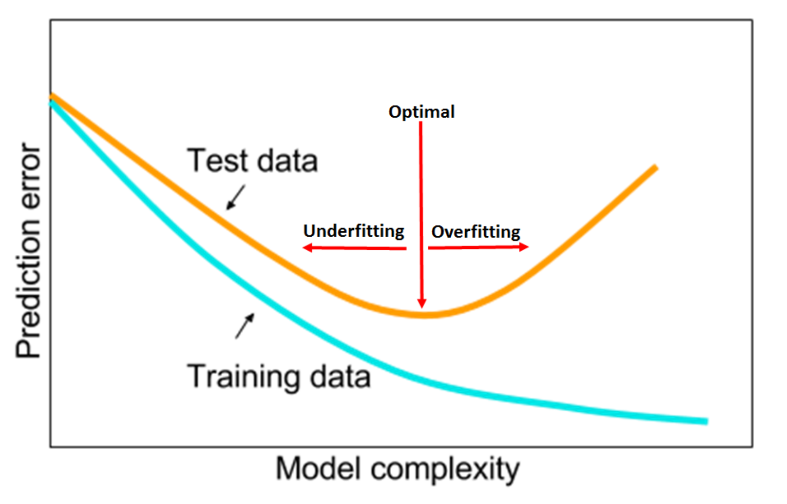
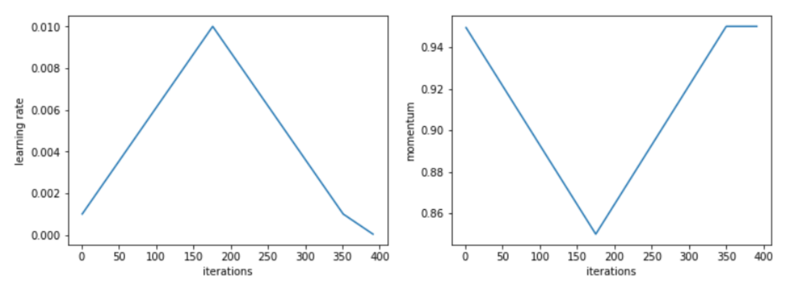

In his most recent [work](https://arxiv.org/abs/1803.09820), Leslie N. Smith gives extremely useful practical advice on how to train neural networks and tune the most important hyper-parameters. In his experiments, Smith was able to improve the current State Of The Art (SOTA) results on a number of datasets and network combinations, including the popular CIFAR-10, CIFAR-100, MNIST, and ImageNet.

Smith argues that Learning Rate (LR), Momentum, batch size, and weight decay should be tuned synchronously to find the best configuration that minizines the validation loss and maximize validation accuracy. Such intuitive remark has however been elusive for many researchers in the recent past due to the computational cost associated with such strategies. An extensive grid search across a 4-dimensional hyper-parameters space would, in fact, be extremely expensive ― especially for the average user who doesn't have at his disposal a cluster of GPUs for running experiments.

Leslie Smith goal is therefore to both shade a light on the intrinsic dependencies between such hyper-parameters and presents a good heuristic to rapidly identify the best combination. In addition to that, Smith also gives easy to follow rules of thumbs regarding good starting hyper-parameters to use when approaching a new dataset or architecture, and hints at how to improve on the initial configuration. In this paper, Smith also introduces what he calls the 1cycle policy, a strategy to train neural networks which shows super-convergence capabilities in many datasets if hyper-parameters are correctly chosen.

### Underfitting and Overfitting

Smith points out how, to minimize the prediction error, we need to identify the sweet spot between underfitting and overfitting.

He argues that hyper-parameter configurations which more rapidly reduce the validation loss in the first few epochs and then plateau are generally best, since they:

1. Empirically reach lower validation loss
2. Dramatically reduce computing time ― that can, therefore, be allocated to experiment other things

Smith stresses how large Learning Rate values are desirable since they reduce underfitting and help to regularize the training. On other hand, Smith reminds the reader that extremely high values of Learning Rate can cause the training to diverge. To quickly identify reasonable minimum and maximum boundary values for the Learning Rates with only a few epochs, Smith suggests to use the "LR range test", which he proposed in [an earlier paper](https://arxiv.org/abs/1506.01186). 

### The 1cycle policy

Such a policy requires the coordinated change of Learning Rate and [Momentum](https://en.wikipedia.org/wiki/Stochastic_gradient_descent#Momentum) during training time. During the course of over [1,000 experiment](https://mlconf.com/interview-with-leslie-n-smith-phd-senior-research-scientist-at-the-us-naval-research-laboratory-by-reshama-shaikh-program-committee-member/), Smith noticed how a strategy of one cycle length wherein the first half we increase the LR while decrease Momentum, and then revert the trends in the second half of the cycle, seems to perform particularly well.

In Smith experiments, such policy outperforms in terms of validation score any other previously known training policy, and achieves optimal results in a fraction of the necessary epochs. 

### Batch size, weight decay, and dropout

Small batch sizes, weight decay, and dropout are other popular techniques to regularize neural networks. Smith argues that these regularization techniques should be reduced in favor of using larger learning rates. Larger learning rates, in fact, provide as good regularization properties and, additionally, allow convergence in a shorter number of iterations.

Smith suggested to use the largest batch size allowed by our server and to try a few different combinations of weight decay and dropout while comparing the results using the "LR range test".

### Generalization to different network architectures and dataset

Finally, Smith explores how his recommendations generalize to different network architectures and datasets. Interestingly, he shows how his recommendations hold not just for shallow and residual networks but also in deep architectures like densenets, and hyper-densenets. He also shares [the code](https://github.com/lnsmith54/hyperParam1) he used to improve the results presented in numerous studies while also considerably reducing training time. This is extremely important to further validate the hypothesis that the 1cycle policy is the best currently known general strategy to optimize both shallow and deep networks architectures.

### Conclusions

The recent work of Leslie N. Smith has been fundaments to democratize deep learning and achieving SOTA results on single and multi-GPU configurations. The "LR range test", 1cycle policy, and the heuristics to tune Learning Rate, Momentum, batch size and weight decay presented in this paper are advancing what previously presented in the literature.
